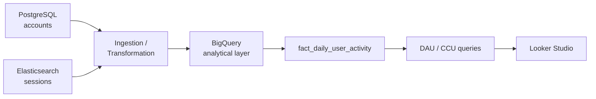

# Architecture

## Overview



The prototype runs the same flow locally with mocks (CSV / NDJSON / DuckDB). The mapping
is one-to-one:

| Layer | Production | Local prototype |
|---|---|---|
| Account source | PostgreSQL `accounts` | `data/sample/accounts.csv` |
| Session source | Elasticsearch `sessions` | `data/sample/sessions.ndjson` |
| Staging | BigQuery landing tables | `data/raw/` (extracted window) |
| Warehouse | BigQuery | DuckDB (`src/warehouse.py`) |
| BI | Looker Studio | `dashboard/README.md` spec |

## Source layer

- **PostgreSQL — `accounts`**: transactional account data (user_id, country, and the
  prototype-added `created_at`/`updated_at` for incremental ingestion). Read via a
  server-side cursor so the table streams rather than loads into memory.
- **Elasticsearch — `sessions`**: high-volume session events (user_id, timestamp, duration,
  platform). Read with a **range query on `timestamp`** so a job pulls a time window, not
  the full 500M-document index.

## Processing layer

`src/pipeline.py` runs extract → transform → load, with the transform expressed in SQL so
the identical logic runs in BigQuery in production:

1. Extract the requested window (plus a configurable reprocess window for late events).
2. Data-quality checks quarantine invalid rows (see `docs/assumptions.md`).
3. Join `sessions → accounts` on `user_id` to attach `country`.
4. Derive the UTC `activity_date` from the event timestamp.
5. `SELECT DISTINCT` to the grain `(activity_date, user_id, platform)`.
6. Idempotent upsert into the fact table.

## Warehouse

BigQuery is the analytical layer. The fact table is **partitioned by `activity_date`** and
**clustered by `country, platform`** because those are exactly the filters the dashboard
uses. Partition pruning skips unrelated dates; clustering co-locates rows that share a
country/platform for faster filtering and grouping. (No specific speedups are claimed —
partitioning/clustering are recommended patterns, not measured results.)

## Analytical model

`fact_daily_user_activity` — grain **one row per (activity_date, user_id, platform)**:

```
2026-09-20 | user_001 | DE | Windows
2026-09-20 | user_001 | DE | Android
2026-09-20 | user_002 | US | iOS
```

`country` is denormalized from accounts into the fact table as an analytical optimization:
the dashboard filters by it constantly, and re-joining at query time would be wasteful.
The source of truth for country remains the accounts table.

## BI layer

Looker Studio connects to BigQuery via the native connector and queries the analytical
model (never raw sessions). See `dashboard/README.md` for the exact fields, filters and
charts.

## Why BigQuery (and not Postgres/Elasticsearch directly)

- **PostgreSQL** is excellent for transactional account data but not ideal for repeatedly
  aggregating hundreds of millions of rows for a dashboard.
- **Elasticsearch** is excellent for search and event retrieval but not intended as a
  general-purpose analytical warehouse for arbitrary SQL BI.
- **BigQuery** is built for large analytical datasets, standard SQL, partitioning/clustering,
  managed infra, and first-class Looker Studio integration.

BigQuery isn't "universally superior" — it's the right choice *for this workload*: the
environment already has BigQuery, the data is analytical in nature, and the dashboard
queries it directly.

## Scale-up path (30M accounts / 500M sessions)

- Extraction already filters at the source; a daily job reads one window.
- The transformation SQL is identical in BigQuery and DuckDB — moving to production means
  landing the sources into BigQuery staging tables and running `sql/marts/`.
- The MERGE upsert is idempotent at any scale; late arrivals are bounded by the reprocess
  window.
